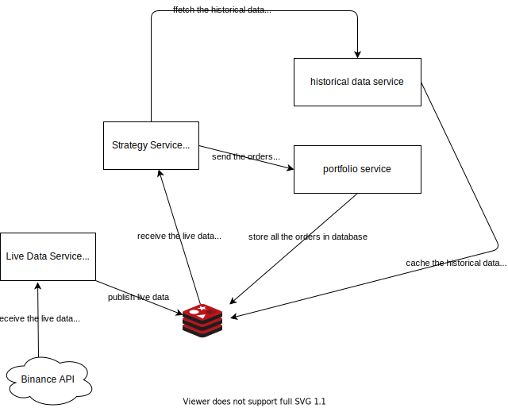

# Crypto Bot

crypto bot uses algorithmic trading strategies to generate buy and sell signals for trading
the crypto currency




## How it works

### How the data is stored:


```javascript
    //historical data

    {
        "open": float,
        "high": float,
        "low": float,
        "close": float,
        "volume": float
    }

    // live data

    {
        'open': float,
        'high': float,
        'low': float,
        'close': float,
        'volume': float,
        'is_interval': boolean,
        "symbol": string, // btcusdt
        "interval": string // "5m", "1m", "1h", "1d"
    }
```

### How the data is accessed:

```bash

# subscribing to the live data service
REDIS> SUBSCRIBE <channel-name>

# reading historical data
REDIS> JSON.GET historical-<tradingsymbol> '$'
```

## How to run it locally?

### Prerequisites

1. python
2. gRPC
3. Redis Stack Server
4. Docker
5. Binance API Key and Secret
6. Pushbullet Access Token

### Local installation

to start the docker container first add the required API keys and SECRETS in the below files

```bash
# live-data-service/.env
SYMBOL=<TICKER> # eg :- btcusdt
INTERVAL=<INTERVAL> # eg :- 1m 5m 1h
CHANNEL_NAME=<STRATEGY_NAME>
```

```bash
# strategy-service/.env
SYMBOL=<TICKER> # eg :- btcusdt
INTERVAL=<INTERVAL> # eg :- 1m 5m 1h
CHANNEL_NAME=<STRATEGY_NAME>

API_KEY=<BINANCE_API_KEY>
API_SECRET=<BINANCE_API_SECRET>

PUSHBULLET_ACCESS_TOKEN=<ACCESS_TOKEN>
```

To run the Docker Containers use the following command

```bash
docker-compose up -d # use -d if you need to run the containers in the background

# access the redis shift using
http://127.0.0.1:8002
```

## Deployment

To make deploys work, you need to create free account on [Redis Cloud](https://redis.info/try-free-dev-to)


### Heroku

[](https://heroku.com/deploy?template=https://github.com/rohit20001221/trading-bot-binance)
